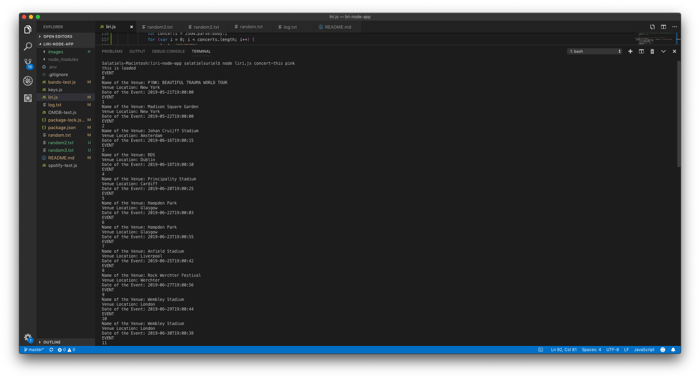

# liri-node-app

By: Sal Suriel

 The LIRI is a _Language_ Interpretation and Recognition Interface. LIRI will be a command line node app that takes in parameters and gives you back data. The user will retrieve data from three different API sources and the results will be recorded in the "log.txt file.

 The commands the user will use to retrieve information will be...

concert-this

spotify-this-song

movie-this

do-what-it-says  

Here are screenshots of the terminal receiving the information from the APIs based on user input.

For a Concert...

concert-this <name-of-performer>

For Song...

spotify-this-song <name-of-song>

For Movie...

movie-this <name-of-movie>

  Below is link of a video of App working with all APIs. The Spotify API for music, the OMDB APi for movies, and the Bands in Town API for Event information. Enjoy!

